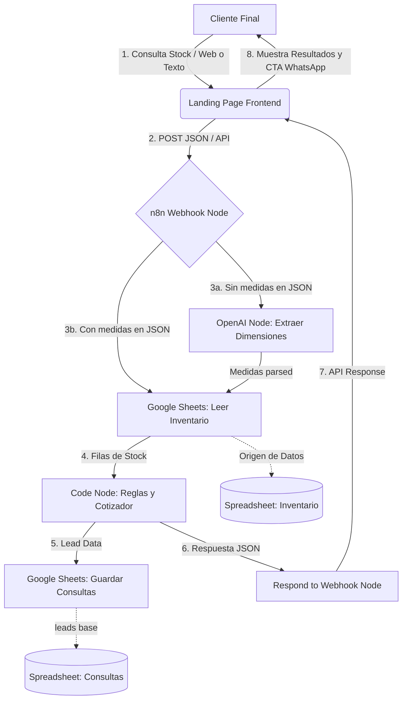

# Proyecto: Termopaneles El Monte - Catálogo de Stock y Consulta Inteligente

Este es el repositorio oficial del MVP de **Termopaneles El Monte**, desarrollado para optimizar la gestión de inventario y facilitar la cotización de vidrios dobles aislantes fijos para clientes residenciales.

---

## Índice
1. [Identificación](#1-identificación)
2. [Resumen Ejecutivo](#2-resumen-ejecutivo)
3. [Problema y Solución](#3-problema-y-solución)
4. [Arquitectura y Flujo de Datos](#4-arquitectura-y-flujo-de-datos)
5. [Cómo Interactúa el Usuario con la Solución](#5-cómo-interactúa-el-usuario-con-la-solución)
6. [Automatización, Inventario y Prompts](#6-automatización-inventario-y-prompts)
7. [Cómo Correrlo](#7-cómo-correrlo)
8. [Track A: Cliente Real y Valor Cuantificado](#8-track-a-cliente-real-y-valor-cuantificado)
9. [Limitaciones y Siguientes Pasos](#9-limitaciones-y-siguientes-pasos)
10. [Roles del Equipo](#10-roles-del-equipo)

---

## 1. Identificación
* **Nombre del Proyecto**: Termopaneles El Monte
* **Track / Caso**: Track A (Cliente Real), Caso A (Landing Page y Automatización), MVP
* **Cliente**: Termopaneles El Monte
* **Ubicación**: El Monte, Provincia de Talagante, Región Metropolitana, Chile
* **Repositorio**: [https://github.com/javieracarrizo2-ship-it/termopaneles-el-monte](https://github.com/javieracarrizo2-ship-it/termopaneles-el-monte)
* **Sitio Desplegado (Producción)**: [https://termopaneles-el-monte.vercel.app](https://termopaneles-el-monte.vercel.app)
* **Integrantes**:
  * **Javiera Carrizo**
  * **Sara Díaz**
  * **Horacio Sánchez**
  * **Raimundo Pérez**
  * **Martín Horta**

---

## 2. Resumen Ejecutivo
Construimos una **landing page dinámica de catálogo** integrada con un **flujo de automatización en n8n** para consultar el inventario de termopaneles fijos en tiempo real y captar leads comerciales. El sistema resuelve la brecha de información de stock y el cálculo de cotizaciones para clientes particulares interesados en remodelaciones o cerramiento de espacios. 

Actualmente el sistema permite visualizar de forma interactiva y responsiva el stock real de vidrios según tamaño, calcular la holgura en centímetros respecto a un vano específico, estimar precios y registrar automáticamente las consultas de clientes en un Google Sheets que sirve como base de datos de leads.

---

## 3. Problema y Solución

### Dolor del Negocio (Termopaneles El Monte)
* **Complejidad de Stock**: Disponer de un volumen alto de termopaneles fijos sin marco con más de 100 combinaciones diferentes de ancho y alto dificulta la visualización del stock.
* **Proceso Manual Ineficiente**: El 100% de las cotizaciones y consultas de disponibilidad se realizaban de forma manual vía telefónica o WhatsApp, causando retrasos y pérdida de oportunidades de venta.
* **Logística Crítica**: Al venderse productos frágiles y de gran peso, el negocio opera exclusivamente con **retiro en tienda física** (`Avenida los carrera 736 B, El monte`). Las solicitudes de despacho a domicilio generaban fricciones y cancelaciones frecuentes.

### Dolor del Cliente Final (Particular/Hogar)
* **Falta de Claridad Técnica**: Los clientes no comprenden qué es un termopanel (vidrio doble aislante sin marco) o cómo medir el espacio de instalación (vano).
* **Asimetría de Información**: No saber si una medida específica está disponible obliga al cliente a contactar directamente al negocio, demorando el inicio de su proyecto de remodelación.

### Solución MVP Propuesta
* **Landing Page de Catálogo**: Un sitio responsivo clásico y de estética residencial que carga dinámicamente el inventario disponible y lo organiza en categorías claras (Chico, Mediano, Grande).
* **Asistente de Medidas e Integración**: Una calculadora de vano integrada que busca las 3 alternativas de stock más cercanas a las dimensiones ingresadas por el cliente.
* **Automatización en n8n**: Un webhook inteligente que lee la disponibilidad de Google Sheets en tiempo real, extrae medidas a partir de textos libres utilizando Inteligencia Artificial (OpenAI) y registra cada lead en un historial de consultas.

---

## 4. Arquitectura y Flujo de Datos

### Diagrama de la Arquitectura (Mermaid)



### Flujo de Datos Paso a Paso
1. El **Cliente** interactúa con el catálogo en la web filtrando por tamaño o ingresa una búsqueda de vano.
2. El **Sitio Web** envía un POST con el payload al webhook del flujo de n8n.
3. El **Flujo n8n** evalúa si la consulta trae dimensiones numéricas:
   * **Con dimensiones**: Pasa directo a leer la planilla de Google Sheets.
   * **Con texto libre**: El nodo OpenAI interpreta el mensaje para extraer el ancho, el alto y la cantidad.
4. El nodo **Google Sheets** lee el inventario real y lo envía al nodo **Code** (JavaScript).
5. El nodo **Code** filtra los agotados, verifica coincidencias con tolerancia de ±0.5 cm, calcula el precio unitario ($25.000) y busca alternativas por distancia Euclidiana en caso de no hallar stock exacto.
6. Se inserta un registro en la hoja de **Google Sheets** `"Consultas"` con los datos de contacto y la respuesta generada.
7. El nodo **Respond to Webhook** envía la respuesta final estructurada en JSON que la landing page dibuja en pantalla.

---

## 5. Cómo Interactúa el Usuario con la Solución

### Perfil: Cliente Particular (Hogar)
1. **Búsqueda e Inspección**: Navega en la landing page y visualiza las categorías (*Chico*, *Mediano*, *Grande*) del inventario disponible en tiempo real.
2. **Uso de Calculadora de Vano**: Ingresa las medidas del espacio que desea cubrir (ej. ancho 80 cm, alto 120 cm).
3. **Recepción de Alternativas**: La calculadora le muestra las 3 alternativas más similares disponibles en el stock físico, detallando la diferencia exacta en centímetros para que el cliente evalúe si le sirve.
4. **Cotización y Contacto**: Hace clic en el botón de WhatsApp prellenado para coordinar el pago y el retiro en El Monte de forma directa.

### Perfil: Administrador del Negocio
1. **Actualización de Stock**: Cuando se fabrica o vende un termopanel, el administrador simplemente actualiza las columnas de la fila correspondiente en la hoja `"Inventario"` de su Google Sheets.
2. **Recepción de Leads**: Abre la hoja `"Consultas"` de Google Sheets para revisar las dimensiones solicitadas, teléfonos, nombres e historial de cotizaciones automatizadas y realizar seguimiento.

---

## 6. Automatización, Inventario y Prompts
* **Fuente de Inventario**: Google Sheets que sirve como base de datos en la nube.
* **Lógica del Algoritmo JS**: 
  * Exclusión de registros con unidades igual o menor a `0`.
  * Filtro de filas con estado `"agotado"`, `"vendido"` o `"no disponible"`.
  * Tolerancia máxima de ±0.5 cm por discrepancias en medidas.
  * Cálculo de alternativas similares por menor distancia Euclidiana.
* **Prompt de Extracción (OpenAI)**: Ubicado en [prompt-extraccion-medidas.txt](file:///c:/Users/Javiera%20Carrizo/OneDrive/Documentos/Demo%20agentic/src/prompts/prompt-extraccion-medidas.txt), diseñado para extraer y estandarizar las medidas de textos como *"hola, busco uno de 21 x 1 metro"*.

### Reglas de Negocio
* **Logística Estricta**: No se realizan despachos; solo retiro coordinado en `Avenida los carrera 736 B, El monte`.
* **Precio Unitario Fijo**: $25.000 CLP para estimaciones iniciales.
* **No Inventar Stock**: Si un producto no tiene unidades en la hoja de Sheets, no se muestra ni se promete disponibilidad bajo ningún escenario.

---

## 7. Cómo Correrlo

### Requisitos Previos
* Servidor local o hosting estático (ej. Vercel).
* Cuenta de n8n activa.
* Credenciales de Google Sheets y OpenAI API Key.

### Instrucciones
1. **Clonar Repositorio**:
   ```bash
   git clone https://github.com/javieracarrizo2-ship-it/termopaneles-el-monte.git
   ```
2. **Levantar Servidor Local**: Al tratarse de una web estática pura, puedes abrir `index.html` con cualquier servidor local de desarrollo (como *Live Server* en VSCode o ejecutando `npx http-server` en el directorio raíz).
3. **Configurar n8n**:
   * Importa el flujo desde [n8n-workflow-termopaneles.json](file:///c:/Users/Javiera%20Carrizo/OneDrive/Documentos/Demo%20agentic/src/flujo/n8n-workflow-termopaneles.json).
   * Vincula tus credenciales de OpenAI y Google Sheets.
   * Modifica los IDs de planilla a tus respectivas hojas de cálculo de Drive.
   * Activa el flujo.

> [!WARNING]
> **Advertencia de Seguridad**: Nunca subas credenciales privadas, tokens de OpenAI o enlaces privados de base de datos al repositorio de Git público. Asegúrate de que las API Keys se manejen en variables de entorno o credenciales cifradas de n8n.

---

## 8. Track A: Cliente Real y Valor Cuantificado
* **Cliente**: Termopaneles El Monte.
* **Baseline (Antes del MVP)**: El 100% de las consultas comerciales demandaban atención humana manual para ir físicamente a revisar el rack de almacenamiento, demorando entre 1 y 4 horas la respuesta final al cliente.
* **Indicadores Clave del Éxito (KPIs)**:
  * **Tiempo de Respuesta Inicial**: Reducido de horas a menos de 2 segundos mediante la calculadora e inventario dinámico.
  * **Porcentaje de Cotizaciones Automáticas**: Cuantificar el volumen de consultas que reciben precio estimado de forma inmediata.
  * **Consultas Registradas en Sheets**: Conversión de usuarios web a leads calificados capturados en la planilla.
  * **Eficiencia Operativa**: Reducción de horas semanales invertidas por el personal del negocio en la revisión manual de racks de almacenamiento.

---

## 9. Limitaciones y Siguientes Pasos

### Limitaciones Actuales
* **Validación Humana**: El stock final y la reserva del vidrio requieren confirmación humana por WhatsApp para evitar ventas simultáneas.
* **Solo Retiro**: La imposibilidad de ofrecer despacho automático restringe las ventas a nivel geográfico local.
* **Actualización Manual**: El inventario en Google Sheets depende de que el negocio registre las entradas y salidas de forma manual.

### Siguientes Pasos
1. **Sincronización de Stock mediante Escáner**: Integración con códigos QR o de barra en cada rack para actualizar las unidades en Google Sheets de forma móvil en un solo paso.
2. **Notificación de Bajo Stock**: Alerta en Slack o correo cuando una medida estándar se quede con 0 unidades.
3. **Pasarela de Pago Básica**: Permitir reservar el vidrio realizando una transferencia directa o Webpay con validación automática del comprobante de pago.

---

## 10. Roles del Equipo

| Integrante | Rol Principal | Contribución Clave | Fuente de Verificación (Commits) |
| :--- | :--- | :--- | :--- |
| **Javiera Carrizo** | Directora de Desarrollo / Tech Lead | Desarrollo de frontend estático, integración del planificador SVG dinámico, parser CSV, integración de webhook n8n y optimización responsiva del layout. | Múltiples commits en la rama `main` y `chore/organizar-entrega-final` |
| **Sara Díaz** | Por validar por el equipo | Por validar por el equipo | Por validar por el equipo |
| **Horacio Sánchez** | Por validar por el equipo | Por validar por el equipo | Por validar por el equipo |
| **Raimundo Pérez**| Por validar por el equipo | Por validar por el equipo | Por validar por el equipo |
| **Martín Horta**  | Por validar por el equipo | Por validar por el equipo | Por validar por el equipo |
