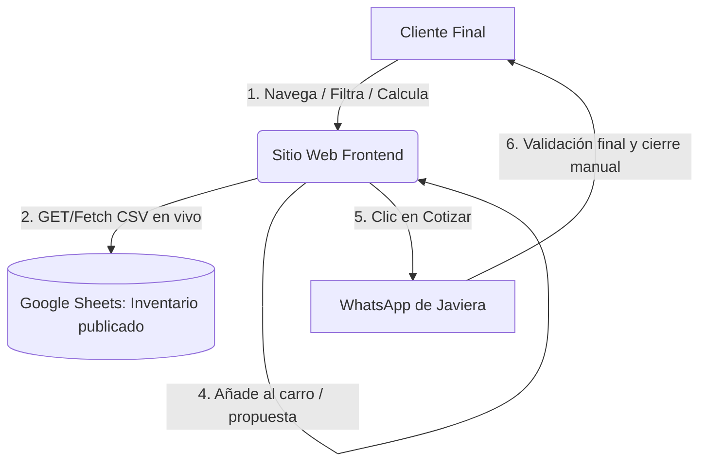

# Arquitectura del Sistema y Flujo de Datos

Este documento describe la arquitectura técnica simplificada de la solución construida para la consulta de stock y captación de clientes de **Termopaneles El Monte**.

## Diagrama de la Solución (Mermaid)

---

## Detalle del Flujo Paso a Paso

1. **Lectura de Datos**: El sitio web carga el catálogo de termopaneles en formato CSV consumiendo directamente la URL de publicación de Google Sheets al iniciar la página.
2. **Filtrado Local**: Toda la lógica de búsqueda por texto, categorización por tamaño, cálculo de diferencias en la calculadora de vanos y combinaciones del planificador de cobertura se ejecutan de manera instantánea y local en el navegador del cliente (dentro de `app.js`).
3. **Cero Dependencias**: No se requiere de un backend activo (como n8n) ni de modelos de IA de pago (como OpenAI), eliminando cualquier costo de mantenimiento y haciéndolo inmune a la falta de créditos de APIs.
4. **Envío de Cotización**: Al concretar la cotización (desde el carro de compras o el planificador), el sistema abre una pestaña de WhatsApp con la información y el mensaje preformateado y acortado listo para ser enviado a la vendedora, quien realiza el cierre y confirmación de stock final.
