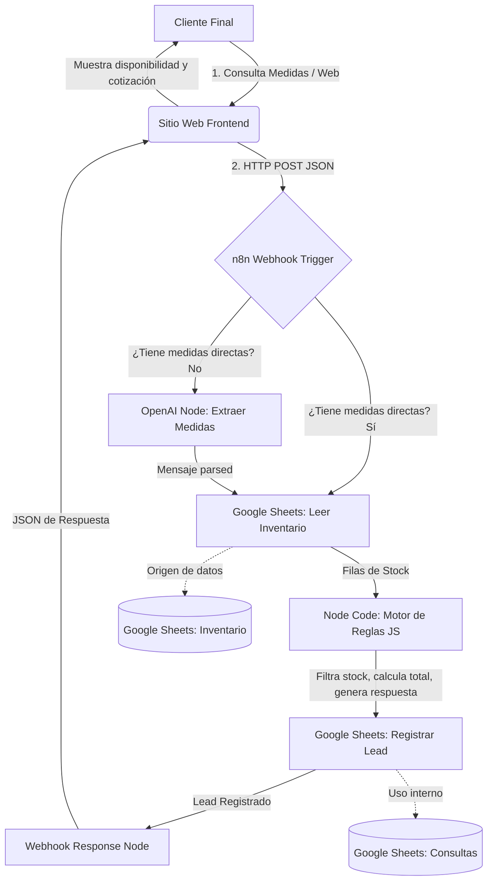

# Arquitectura del Sistema y Flujo de Datos

Este documento describe la arquitectura técnica de la solución construida para la consulta de stock y captación de leads de **Termopaneles El Monte**.

## Diagrama de la Solución (Mermaid)

---

## Detalle del Flujo Paso a Paso

1. **Interacción del Cliente**: El usuario ingresa a la landing page y busca medidas utilizando los filtros visuales, o bien escribe una consulta de texto libre en el formulario de la calculadora.
2. **Envío al Webhook**: La web envía una solicitud POST al webhook de n8n. Si el usuario usó la calculadora de vanos o el catálogo, los valores `ancho_cm` y `alto_cm` se envían estructurados. Si fue por texto libre, se envía el `mensaje`.
3. **Decisión y Parsing de IA**: 
   * Si las medidas están presentes en la raíz, el flujo omite el paso de IA.
   * Si solo hay un mensaje, el nodo de **OpenAI** analiza la consulta utilizando el modelo `gpt-4o-mini` y devuelve un JSON estructurado con el ancho, el alto y la cantidad.
4. **Consulta en Tiempo Real**: n8n lee todas las filas de la planilla de **Google Sheets** (hoja "Inventario").
5. **Filtrado y Tolerancia (Node Code)**: El script de JavaScript limpia las filas agotadas y busca coincidencia exacta con una tolerancia de **±0.5 cm**. Si no hay coincidencia exacta, se buscan y devuelven las 3 alternativas más cercanas (por distancia Euclidiana).
6. **Mapeo de Leads**: La consulta y la respuesta generada se guardan automáticamente en la hoja **"Consultas"** de Google Sheets para seguimiento comercial.
7. **Respuesta al Cliente**: El webhook responde con un JSON final estructurado con el stock real y la cotización para que el sitio web actualice la interfaz de usuario en menos de 2 segundos.
